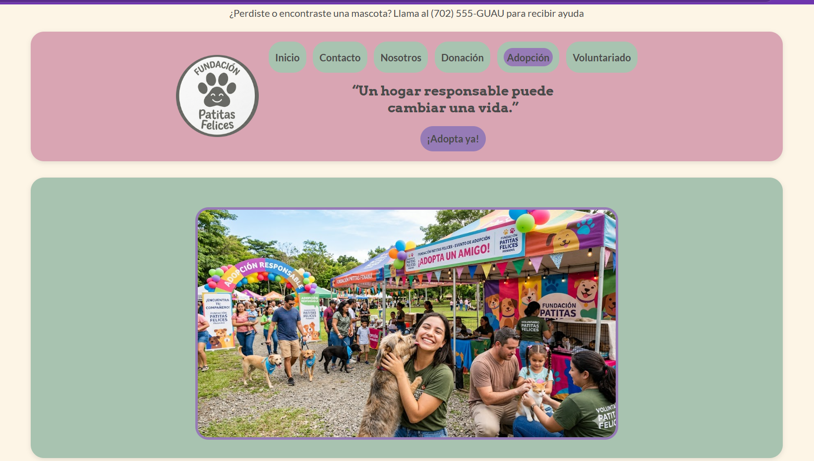
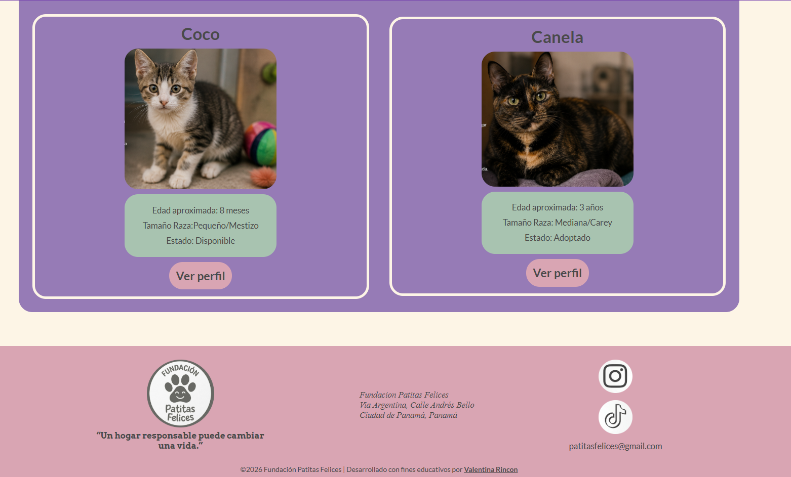
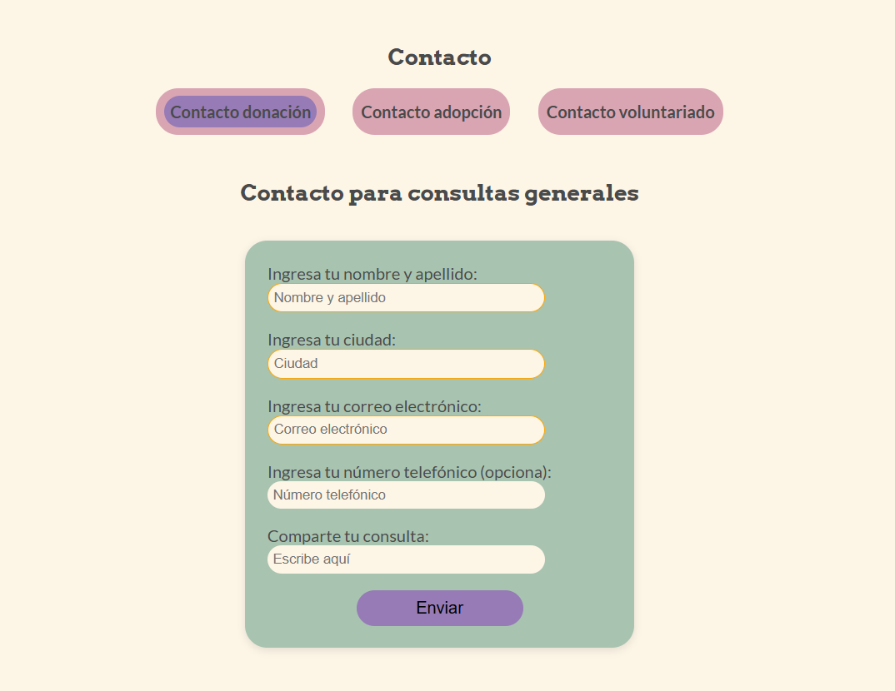

# Fundación Patitas Felices 💚
## Maqueta web responsive desarrollada con HTML y CSS puro.

### Descripción del proyecto
Este proyecto consiste en una maqueta web estática para una fundación ficticia llamada "Patitas Felices", un refugio para animales de calle. 
Está página fue desarrollada puramente con HTML y CSS, sin hacer uso de JavaScript.  

### Características principales

* Diseño responsive que se adapta a 3 pantallas diferentes(celular, tablet y laptop)
* Barra de navegación con diversos botones que te llevan a las otras páginas.
* Carrusel automático de fotos y elementos 
* Catálogo de animales disponibles en adopción
* Página de perfil detallada para cada animal
* Formularios de contacto
* Footer con ubicación y redes sociales
* Diseño visual atractivo con colores pastel

### Tecnologías utilizadas
* HTML5 
* CSS3
* Flexbox 
* Grid
* Media Queries
* Animaciones (keyframes)

### Instrucciones de ejecución
1. Clonar el repositorio
2. Abrir la carpeta del proyecto
3. Ir al archivo "Index.html" y ejecutarlo en el navegador.

### Vistas principales

#### Página Principal

#### Catálogo de adopción y footer

#### Formularios de contacto
 

### Desarrolladora 
Valentina Rincon - Proyecto de diseño y desarrollo web.
